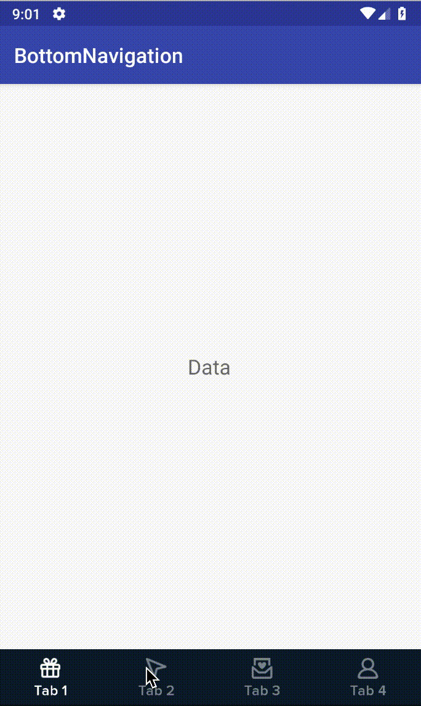

# Eazy Bottom Navigation
This library allows you to show bottom navigation **quickly** and **simply**

[](https://www.codacy.com/app/harryle-fit/bottomnavigation?utm_source=github.com&amp;utm_medium=referral&amp;utm_content=harrylefit/bottomnavigation&amp;utm_campaign=Badge_Grade)
[](https://jitpack.io/#harrylefit/bottomnavigation)
[](https://android-arsenal.com/api?level=19)
[](https://android-arsenal.com/details/1/7352)


<p align="center"><a href="https://github.com/harrylefit/bottomnavigation" target="_blank"></a></p>

Usages
------
- Set Menu : BottomNavigation.setMenu(R.menu.nav)
- Setup with viewpager : `BottomNavigation.setupWithViewPager(ViewPager)`
- Handle listener on navigation : `BottomNavigation.setOnNavigationListener(listener)`
- Show Navigation : `BottomNavigation.show()`
- Hide Navigation : `BottomNavigation.hide()`
- Show Navigation with animation : `Coming soon`
- Hide Navigation with animation  : `Coming soon`
- Update notification for tab : `BottomNavigation.updateNotification(index,notificationCount)`
- Disable tabs : `BottomNavigation.disableTabs(indexArray)`
- Active tabs : `BottomNavigation.activeTabs(indexArray)`
- Disable all tab : `BottomNavigation.disableAllTabs()`
- Active all tab : `BottomNavigation.activeAllTabs()`

```groovy
repositories {
    maven {
        url "https://jitpack.io"
    }
}
```


#####  Avoiding wrong tab when activity was restarted.
```kotlin
    override fun onSaveInstanceState(outState: Bundle?) {
        super.onSaveInstanceState(outState)
        nav.onSaveInstanceStateView(outState)
    }

    override fun onRestoreInstanceState(savedInstanceState: Bundle?) {
        super.onRestoreInstanceState(savedInstanceState)
        nav.onRestoreInstanceStateView(savedInstanceState)
    }
```


Download
--------

```groovy
 implementation 'com.github.harrylefit:bottomnavigation:1.1.6.2'
```


Apache License, Version 2.0


    Copyright (C) 2018, Harry Le

    Licensed under the Apache License, Version 2.0 (the "License");
    you may not use this file except in compliance with the License.
    You may obtain a copy of the License at

         http://www.apache.org/licenses/LICENSE-2.0

    Unless required by applicable law or agreed to in writing, software
    distributed under the License is distributed on an "AS IS" BASIS,
    WITHOUT WARRANTIES OR CONDITIONS OF ANY KIND, either express or implied.
    See the License for the specific language governing permissions and
    limitations under the License.
